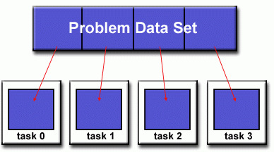
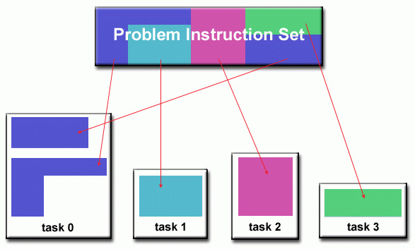
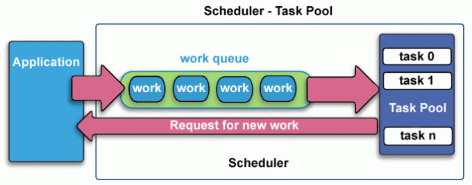

# Sisop-FP-2025-IT-C06

## Peraturan
1. Waktu pengerjaan dimulai hari Kamis (19 Juni 2025) setelah soal dibagikan hingga hari Rabu (25 Juni 2025) pukul 23.59 WIB.
2. Praktikan diharapkan membuat laporan penjelasan dan penyelesaian soal dalam bentuk Readme(github).
3. Format nama repository github “Sisop-FP-2025-IT-[Kelas][Kelompok]” (contoh:Sisop-FP-2025-IT-A01).
4. Setelah pengerjaan selesai, seluruh source code dan semua script bash, awk, dan file yang berisi cron job ditaruh di github masing - masing kelompok, dan link github dikumpulkan pada form yang disediakan. Pastikan github di setting ke publik.
5. Commit terakhir maksimal 10 menit setelah waktu pengerjaan berakhir. Jika melewati maka akan dinilai berdasarkan commit terakhir.
6. Jika tidak ada pengumuman perubahan soal oleh asisten, maka soal dianggap dapat diselesaikan.
7. Jika ditemukan soal yang tidak dapat diselesaikan, harap menuliskannya pada Readme beserta permasalahan yang ditemukan.
8. Praktikan tidak diperbolehkan menanyakan jawaban dari soal yang diberikan kepada asisten maupun praktikan dari kelompok lainnya.
9. Jika ditemukan indikasi kecurangan dalam bentuk apapun di pengerjaan soal final project, maka nilai dianggap 0.
10. Pengerjaan soal final project sesuai dengan modul yang telah diajarkan.
    
## Anggota Kelompok

| Nama                         | NRP        |
| ---------------------------- | ---------- |
| Syifa Nurul Alfiah           | 5027241019 |
| Khumaidi Kharis Az-zacky     | 5027241049 |
| M. Hikari Reiziq Rakhmadinta | 5027241079 |
| Muhammad Farrel Shaputra     | 5027241110 |

## Deskripsi Soal 18 - Math Threading

### a. Dua variabel global hardcoded

```cpp
const int NUM_SIZE = 999999;
const int NUM_THREADS = 4;
```

Variabel global `NUM_SIZE` dan `NUM_THREADS` di-hardcode:

* `NUM_SIZE`: jumlah elemen total.
* `NUM_THREADS`: jumlah thread.

### b. NUM\_SIZE dibagi ke setiap thread

```cpp
long long base_chunk_per_thread = NUM_SIZE / NUM_THREADS;
long long remainder = NUM_SIZE % NUM_THREADS;
```

* `base_chunk_per_thread` digunakan untuk membagi elemen ke tiap thread.
* `remainder` digunakan untuk menyimpan sisa elemen jika pembagian tidak rata.

### c. Penanganan sisa pembagian

```cpp
if (i == NUM_THREADS - 1) {
    chunk_size += remainder;
}
```

* Jika ada sisa (`remainder`), elemen sisa ditambahkan ke thread terakhir.
* Ini memastikan jumlah total tetap sama dengan `NUM_SIZE`.

### d. Print setiap thread dan angka yang ditanganinya

```cpp
std::cout << "Thread " << thread_id << " (Elemen " << start_element << "-" << end_element - 1
          << ") selesai. Hasil lokal: " << local_result << std::endl;
```

* Print ID thread, range elemen, dan jumlah yang dihitung oleh thread tersebut.
* Diletakkan di dalam `cout_mutex` agar hasil print tidak bercampur.

### e. Print hasil akhir

```cpp
std::cout << "Hasil akhir penjumlahan global: " << global_sum << std::endl;
```

* Menampilkan hasil akhir dari semua penjumlahan `local_result` setiap thread.
* Hasil ini harus sama dengan `NUM_SIZE`.

## Cara Kompilasi dan Menjalankan

```bash
g++ -std=c++11 -o math_threading math_threading.cpp -pthread
./math_threading
```

## Struktur Repository

```
.
├── math_threading.cpp
├── README.md
└── assets/
       └── Video_demo.mkv
       └── domain_decomp.jpg
       └── functional_decomp.jpg
       └── schedulerTaskPool.jpg
```

### Konsep Dasar Pembagian Kerja (Partitioning)

Salah satu langkah pertama dalam merancang program paralel adalah memecah masalah menjadi "potongan" pekerjaan diskrit yang dapat didistribusikan ke beberapa tugas. Ini dikenal sebagai dekomposisi atau partisi. Ada dua cara dasar untuk membagi pekerjaan komputasi di antara tugas paralel: **dekomposisi domain** dan **dekomposisi fungsional**.

- **Dekomposisi Domain (Domain Decomposition)**: Dalam jenis partisi ini, data yang terkait dengan masalah terurai. Setiap tugas paralel kemudian bekerja pada sebagian data. Contohnya adalah memproses array besar, di mana setiap thread diberi sebagian dari array tersebut untuk dihitung.



- **Dekomposisi Fungsional (Functional Decomposition)**: Dalam pendekatan ini, fokusnya adalah pada komputasi yang akan dilakukan daripada pada data yang dimanipulasi oleh komputasi. Masalahnya terurai sesuai dengan pekerjaan yang harus dilakukan. Setiap tugas kemudian melakukan sebagian dari keseluruhan pekerjaan. Misalnya, satu thread menangani I/O, sementara thread lain melakukan komputasi.



Kode yang kami berikan sebelumnya adalah contoh jelas dari **Dekomposisi Domain**, di mana domain angka dari `0` hingga `NUM_SIZE - 1` dibagi menjadi beberapa sub-rentang untuk setiap thread.

### Alokasi Tugas (Load Balancing)

*Load Balancing* mengacu pada praktik mendistribusikan jumlah pekerjaan yang kira-kira sama di antara tugas-tugas sehingga semua tugas tetap sibuk sepanjang waktu. Ini dapat dianggap sebagai minimalisasi waktu idle tugas. *Load Balancing* penting untuk program paralel karena alasan kinerja. Misalnya, jika semua tugas tunduk pada titik sinkronisasi penghalang, tugas paling lambat akan menentukan performa secara keseluruhan.

**Cara Mencapai *Load Balancing***

Untuk operasi array/matriks di mana setiap tugas melakukan pekerjaan yang sama, distribusikan kumpulan data secara merata di antara tugas. Untuk iterasi perulangan di mana pekerjaan yang dilakukan dalam setiap iterasi serupa, distribusikan iterasi secara merata di seluruh tugas.

- **Alokasi Statis (Static Load Balancing)**: Beban kerja didistribusikan di antara thread **sebelum** eksekusi dimulai. Beban untuk setiap thread bersifat tetap. Metode ini efisien jika tugas-tugasnya seragam dan dapat diprediksi, seperti dalam file math_thread.CPP kami
    
    **Solusi Kode (Contoh Alokasi Statis dari Kode ):**
    
    ```cpp
    // Bagian Kunci dari Alokasi Statis
    // Beban kerja dihitung di awal sebelum thread melakukan tugas utama.
    long long base_chunk_per_thread = NUM_SIZE / NUM_THREADS;
    long long remainder = NUM_SIZE % NUM_THREADS;
    long long current_start = 0;
    
    for (int i = 0; i < NUM_THREADS; ++i) {
        long long chunk_size = base_chunk_per_thread;
        if (i == NUM_THREADS - 1) {
            chunk_size += remainder;
        }
        long long end_element = current_start + chunk_size;
    
        // Jatah (start_element, end_element) sudah final saat thread dibuat.
        threads.emplace_back(worker_function, i, current_start, end_element);
        current_start = end_element;
    }
    ```
    
- **Alokasi Dinamis (Dynamic Load Balancing)**: Beban kerja didistribusikan saat program berjalan. Biasanya, ada antrean tugas (*task pool*) di mana thread yang menganggur dapat mengambil pekerjaan baru. Ini lebih baik untuk tugas yang tidak dapat diprediksi tetapi memiliki overhead manajemen yang lebih tinggi.

Ketika jumlah pekerjaan yang akan dilakukan setiap tugas sengaja bervariasi, atau tidak dapat diprediksi, mungkin akan membantu untuk menggunakan pendekatan ***kumpulan tugas penjadwal***. Saat setiap tugas menyelesaikan pekerjaannya, ia menerima bagian baru dari antrean kerja.



Pada akhirnya, mungkin perlu untuk merancang algoritme yang mendeteksi dan menangani ketidakseimbangan beban saat terjadi secara dinamis dalam kode.

### Crtitical Section dan Synchronization

a) Critical Section

*Critical section* adalah bagian dari program di mana proses atau thread mengakses sumber daya bersama (shared resource), seperti variabel global atau output terminal. Ketika dua atau lebih thread memasuki critical section secara bersamaan tanpa pengaturan, maka berpotensi terjadi data rusak, hasil yang salah, atau output tercampur(race condition).

Contoh critical section pada code,

    //Akses ke variabel global_sum
    {
    std::lock_guard<std::mutex> lock(sum_mutex);
    global_sum += local_result;
    }

Bagian code ini adalah critical section karena semua thread mencoba menambahkan *local_result* ke *global_sum*. Jika tidak dilindungi, hasil akhirnya bisa salah akibat race condition.

b) Synchronization

*Synchronization* adalah teknik untuk mengontrol urutan eksekusi thread agar tidak terjadi konflik dalam critical section. Salah satu metode paling umum adalah penggunaan mutex untuk mengunci akses ke resource saat sedang digunakan oleh satu thread.

Contoh Synchronization pada code,

    //Akses ke std::cout
    {
    std::lock_guard<std::mutex> lock(cout_mutex);
    std::cout << "Thread " << thread_id << "..." << std::endl;
    }

Di code ini, mutex _cout_mutex_ digunakan untuk mencegah hasil print antar thread saling bertabrakan. Dengan penggunaan _std::lock_guard<std::mutex>_, memastikan hanya satu thread yang bisa menjalankan bagian critical section pada satu waktu.

### Race Condition

*Race condition* terjadi ketika dua atau lebih thread/proses mengakses dan merubah shared resource secara bersamaan, dan hasilnya program tergantung pada urutan eksekusi thread-thread tersebut.

Dalam race condition, proses yang menang atau tereksekusi terlebih dahulu dapat memengaruhi hasil akhir, dan hal ini dapat menyebabkan hasil yang salah.

Misalnya dua thread mencoba memperbarui variabel total:
- Thread A membaca _total = 5_, lalu menambahkan 1 dan menyimpan _total = 6_
- Thread B membaca _total = 5_, lalu menguranginya 1 dan menyimpan _total = 4_
jika terjadi interleaving intruksi dan terjadi race condition, hasil akhir total bisa saja salah, misalnya menjadi 4 atau 6. Padahal, seharusnya penambahan dan pengurangan dalam kasus ini saling mengimbangi sehingga nilai akhir seharusnya tetap 5.

Implementasi code untuk menghindari race condition,

    std::lock_guard<std::mutex> lock(sum_mutex);
    global_sum += local_result;

Di code ini, race condition bisa terjadi jika tidak disinkronkan. Variabel _global_sum_ digunakan bersama oleh semua thread. Jika dua atau lebih thread menjalankan _global_sum_ _+=_ _local_result_ secara bersamaan tanpa mutex, hasil akhirnya bisa tidak akurat karena proses membaca _global_sum_ bisa terjadi bersamaan atau nilai yang disimpan bisa menimpa hasil thread lain.

### Thread-Aware Partitioning
Thread-aware partitioning merupakan strategi pembagian sumber daya (seperti cache atau data) yang memperhatikan identitas dan kebutuhan spesifik dari setiap thread. Dalam arsitektur multithreaded, setiap thread memiliki beban kerja dan pola akses yang berbeda. Jika pembagian dilakukan tanpa memperhatikan ini, maka thread bisa saling mengganggu. Misalnya satu thread bisa mengusir (evict) data thread lain dari cache, mengakibatkan penurunan performa. Setiap thread diberi bagian data yang spesifik dan eksklusif, tanpa tumpang tindih agar tidak terjadi konflik antar thread, baik dalam pengolahan data maupun dalam penggunaan sumber daya.

Contoh dalam kode:
```cpp
long long current_start = 0;

    // Membuat dan menjalankan thread
    for (int i = 0; i < NUM_THREADS; ++i) {
        long long chunk_size = base_chunk_per_thread;
        
        // 3. Tambahkan sisa pembagian ke thread terakhir
        if (i == NUM_THREADS - 1) {
            chunk_size += remainder;
        }

        long long end_element = current_start + chunk_size;

        // Membuat thread baru dan menjalankannya dengan worker_function
        threads.emplace_back(worker_function, i, current_start, end_element);

        // Update indeks awal untuk thread berikutnya
        current_start = end_element;
    }
```
* current_start dan end_element menentukan jangkauan data masing-masing thread
* Setiap thread hanya memproses elemen dari start ke end - 1, yang tidak tumpang tindih dengan thread lain

### Load Balancing dan Efisiensi
Load balancing adalah prinsip penting dalam komputasi paralel yang bertujuan memastikan bahwa setiap thread bekerja dengan beban yang seimbang. Tanpa balancing, satu thread bisa selesai jauh lebih cepat daripada yang lain, menciptakan waktu idle yang membuang sumber daya CPU. Load balancing bertujuan agar setiap thread memiliki beban kerja yang merata. Bila NUM_SIZE tidak habis dibagi oleh NUM_THREADS, maka sisa dibagikan agar tidak ada thread yang idle lebih cepat.

Contoh dalam kode:
```cpp
long long base_chunk_per_thread = NUM_SIZE / NUM_THREADS;
    long long remainder = NUM_SIZE % NUM_THREADS;
    
    long long current_start = 0;

    // Membuat dan menjalankan thread
    for (int i = 0; i < NUM_THREADS; ++i) {
        long long chunk_size = base_chunk_per_thread;
        
        // 3. Tambahkan sisa pembagian ke thread terakhir
        if (i == NUM_THREADS - 1) {
            chunk_size += remainder;
        }
```
* base_chunk_per_thread memberikan jumlah elemen dasar ke setiap thread
* remainder dialokasikan hanya ke thread terakhir agar total elemen tetap NUM_SIZE

### Desain Sistem Paralel yang Terukur dan Efisien
Sistem paralel modern, baik dalam perangkat keras maupun perangkat lunak, perlu dirancang secara terukur agar setiap thread atau task mendapat alokasi kerja yang sesuai. Dalam jurnal ini Huang et al. menjelaskan pentingnya adaptive allocation terhadap cache berdasarkan akses thread. Implementasi ini memastikan bahwa setiap thread memiliki batas awal dan akhir (start–end index) yang jelas, sehingga tidak tumpang tindih dan tidak ada data yang terlewat. Hal ini menjamin determinisme (konsistensi hasil) dan efisiensi eksekusi.

Contoh dalam kode:
```cpp
{
    std::lock_guard<std::mutex> lock(sum_mutex);
    global_sum += local_result;
}
// --- Akhir Critical Section ---


// --- Critical Section untuk Printing ---
// Mengunci output agar tidak tercampur dengan thread lain.
{
    std::lock_guard<std::mutex> lock(cout_mutex);
    // 4. Print setiap thread dan angka yang mereka miliki
    // (end_element - 1) karena end_element bersifat eksklusif (tidak termasuk)
    std::cout << "Thread " << thread_id << " (Elemen " << start_element << "-" << end_element - 1
        << ") selesai. Hasil lokal: " << local_result << std::endl;
}
```
* std::lock_guard<std::mutex> melindungi global_sum dan output terminal dari akses serentak, menjamin konsistensi hasil
* Ini menunjukkan penerapan critical section dengan desain yang terukur dan aman dalam konteks threading

## Video Demonstrasi

[Akses Video dalam Assets](./Assets/Video_Demo.mkv)

https://github.com/user-attachments/assets/89488b9f-5809-4926-957f-9f11f9c99896


## Daftar Pustaka
[1] Barney, B. (2024). Introduction to Parallel Computing Tutorial. Lawrence Livermore National Laboratory. pp. 20-21.

[2] Silberschatz, Galvin, Gagne. Operating System Concepts Essentials, 8th ed. Wiley. Chapter 6.2 – The Critical-Section Problem

[3] Stallings, W. (2018). Operating Systems: Internals and Design Principles, 9th Edition. Pearson. Appendix A.1 - Race Conditions and Semaphores

[4] Tanenbaum, A. S., & Bos, H. Modern Operating Systems, 4th ed. (Concurrency: Chapter 2.3–2.5).

[5] K. Huang et al., “Access Adaptive and Thread‑Aware Cache Partitioning in Multicore Systems,” *Electronics*, vol. 7, no. 9, 2018.

